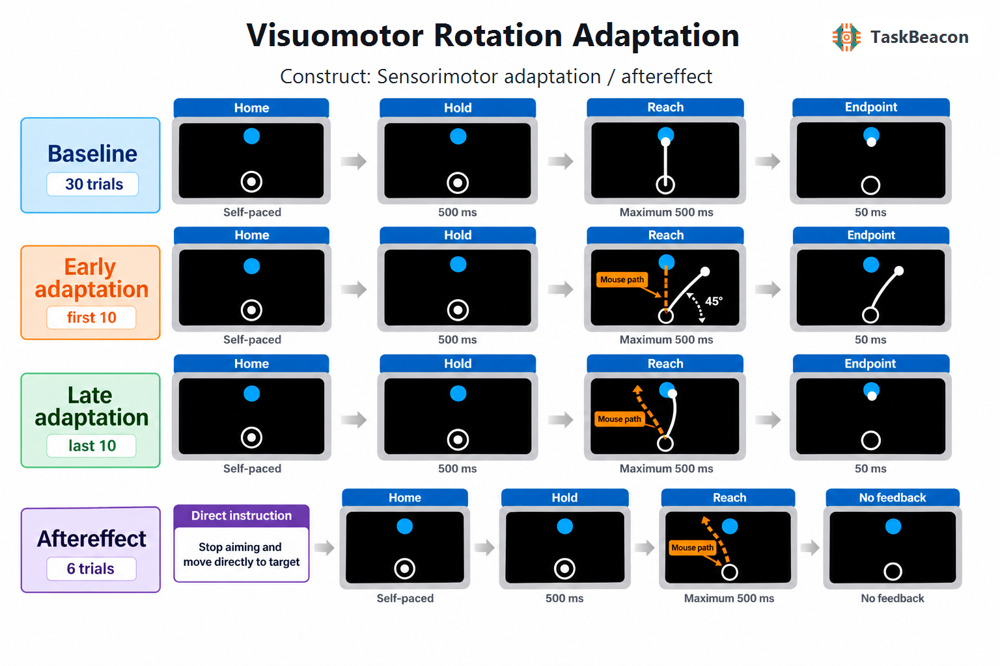

# Visuomotor Rotation Adaptation

## 1. Task Overview

The Visuomotor Rotation Adaptation task measures how reaching movements change when visual cursor feedback is rotated relative to hand movement. Participants use a mouse or trackpad to make rapid centre-out reaches from a white start annulus to one fixed blue target. The canonical human protocol follows the one-target online task reported by Tsay et al. (2024): 30 veridical baseline trials, 54 trials with a counterbalanced 45-degree cursor rotation, and six direct reaches without movement feedback.

| Field | Value |
|---|---|
| Name | Visuomotor Rotation Adaptation |
| Task ID | T000105 |
| Version | v0.1.0 |
| Date Updated | 2026-08-29 |
| PsyFlow Version | 0.1.12 |
| PsychoPy Version | 2025.2.4 |
| Modality | Mouse or trackpad centre-out reaching |
| Variant | Baseline, one-target protocol |
| Acquisition | Behaviour |
| Language | Chinese participant-facing text |
| Primary constructs | Sensorimotor adaptation; implicit recalibration; explicit re-aiming |
| Primary outcomes | Early adaptation; late adaptation; aftereffect |
| Primary source | [Tsay et al., 2024](https://doi.org/10.1038/s41562-023-01798-0) |

## 2. Task Flow

### Block-Level Flow

1. Chinese instructions explain how to return the white cursor to the central annulus and quickly move it through the blue target.
2. A two-choice comprehension check verifies that the participant understands the goal is to find the movement that makes the cursor intersect the target.
3. Baseline: 30 reaches with veridical cursor feedback. A B-key attention check follows trial 10.
4. Adaptation: 54 reaches with the cursor trajectory rotated 45 degrees clockwise or counterclockwise.
5. Aftereffect: six reaches after an instruction to stop any aiming strategy and move directly toward the target; movement feedback is absent.
6. A final screen reports early adaptation, late adaptation, and aftereffect estimates.

### Trial-Level Flow

Each trial begins with a homing/search phase. The cursor is visible only within 2 degrees of the centre. Holding the cursor inside the 0.5-degree-diameter start annulus for 500 ms reveals a 0.5-degree-diameter blue target at a radius of 6 degrees. The participant then makes a click-free mouse/trackpad movement. Veridical or rotated feedback remains visible until the physical pointer reaches the target radius; the endpoint freezes for 50 ms. During aftereffect trials, the cursor disappears immediately after leaving the start. A movement exceeding 500 ms after onset produces a red 750-ms “too slow” message.

### Controller Logic

There is no adaptive controller. A deterministic participant/session hash assigns one of eight target directions and one of two rotation directions, holding both factors constant across all blocks.

### Other logic

The framework records raw physical and displayed pointer trajectories, search time, reaction time, movement time, endpoint angles, cursor-target error, and hit/timeout state. Endpoint hand angles are oriented so compensation opposite the assigned rotation is positive and are baseline-corrected before phase summaries are calculated.

## 3. Configuration Summary

### a. Subject Info

| Field | Human profile |
|---|---|
| Subject ID | Three digits |
| Age | 18-80 |
| Gender | Male / Female / Other |

### b. Window Settings

| Parameter | Value |
|---|---:|
| Resolution | 1280 x 800 |
| Units | Degrees of visual angle |
| Background | Black |
| Monitor width / distance | 35.5 cm / 57 cm |

### c. Stimuli

| Element | Appearance |
|---|---|
| Start | White annulus, 0.5-degree diameter, centred |
| Target | Blue circle, 0.5-degree diameter, 6-degree eccentricity |
| Cursor | White circle, 0.32-degree diameter |
| Timeout | Red Chinese “too slow” message |

### d. Timing

| Event | Duration |
|---|---:|
| Start hold | 500 ms |
| Movement deadline | 500 ms from movement onset |
| Endpoint freeze | 50 ms |
| Too-slow message | 750 ms |

### Triggers

The structured trigger map distinguishes experiment and block boundaries, homing, start hold, target onset for each feedback block, movement onset, reach completion, timeout, cursor hit, attention/instruction checks, and experiment end. Human runs use the configured serial driver; QA and simulation use a mock driver.

### Adaptive controller

Not applicable. Target direction and rotation direction are fixed participant-level counterbalancing factors.

## 4. Methods (for academic publication)

Participants completed a computer-based centre-out reaching task using a mouse or trackpad. Each movement began at a central white annulus and terminated when the physical pointer reached a radial distance of 6 degrees. One blue target direction was selected from eight equally spaced locations and remained fixed throughout the session. After a 500-ms start hold, the target appeared and participants moved rapidly so that the visual cursor intersected it. Movements longer than 500 ms were classified as too slow.

The session contained 90 reaches in three blocks. The baseline block provided veridical cursor feedback for 30 trials. The adaptation block applied a fixed 45-degree clockwise or counterclockwise rotation to the cursor trajectory for 54 trials. The final six trials omitted cursor feedback after movement onset and instructed participants to abandon any aiming strategy and reach directly to the target. Rotation and target directions were counterbalanced deterministically between participants.

The primary endpoint was hand angle at the 6-degree target radius. Angles were oriented so changes opposite the rotation were positive and were corrected by subtracting mean baseline hand angle. Early adaptation was the mean of the first ten rotation trials, late adaptation was the mean of the final ten rotation trials, and aftereffect was the mean of all six no-feedback trials. Trials with timeouts, endpoint deviations greater than 90 degrees, movement times greater than 1 s, or extreme deviations from a moving five-trial window were excluded from summaries. The protocol and definitions follow [Tsay et al. (2024)](https://doi.org/10.1038/s41562-023-01798-0); interpretation of rapid and gradual components is supported by [Taylor et al. (2014)](https://doi.org/10.1523/JNEUROSCI.3619-13.2014), [McDougle et al. (2015)](https://doi.org/10.1523/JNEUROSCI.5061-14.2015), and [Haith et al. (2015)](https://doi.org/10.1523/JNEUROSCI.3869-14.2015).
